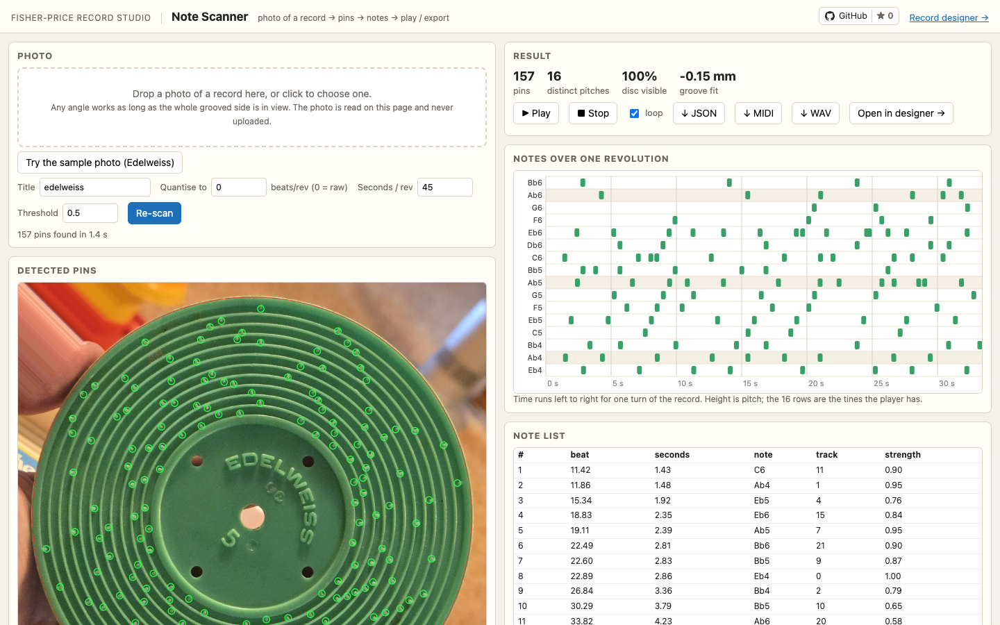
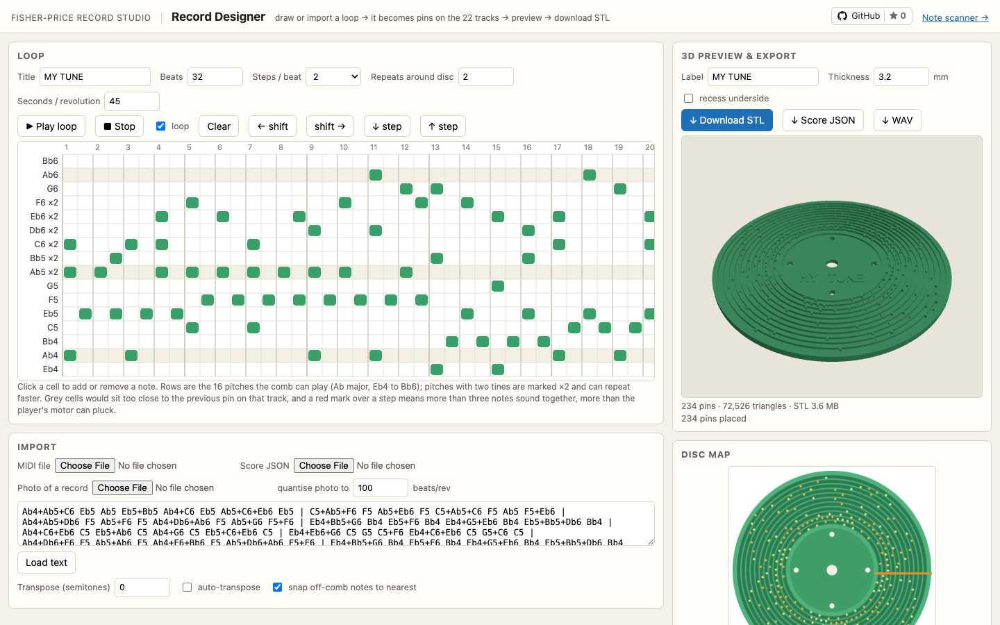
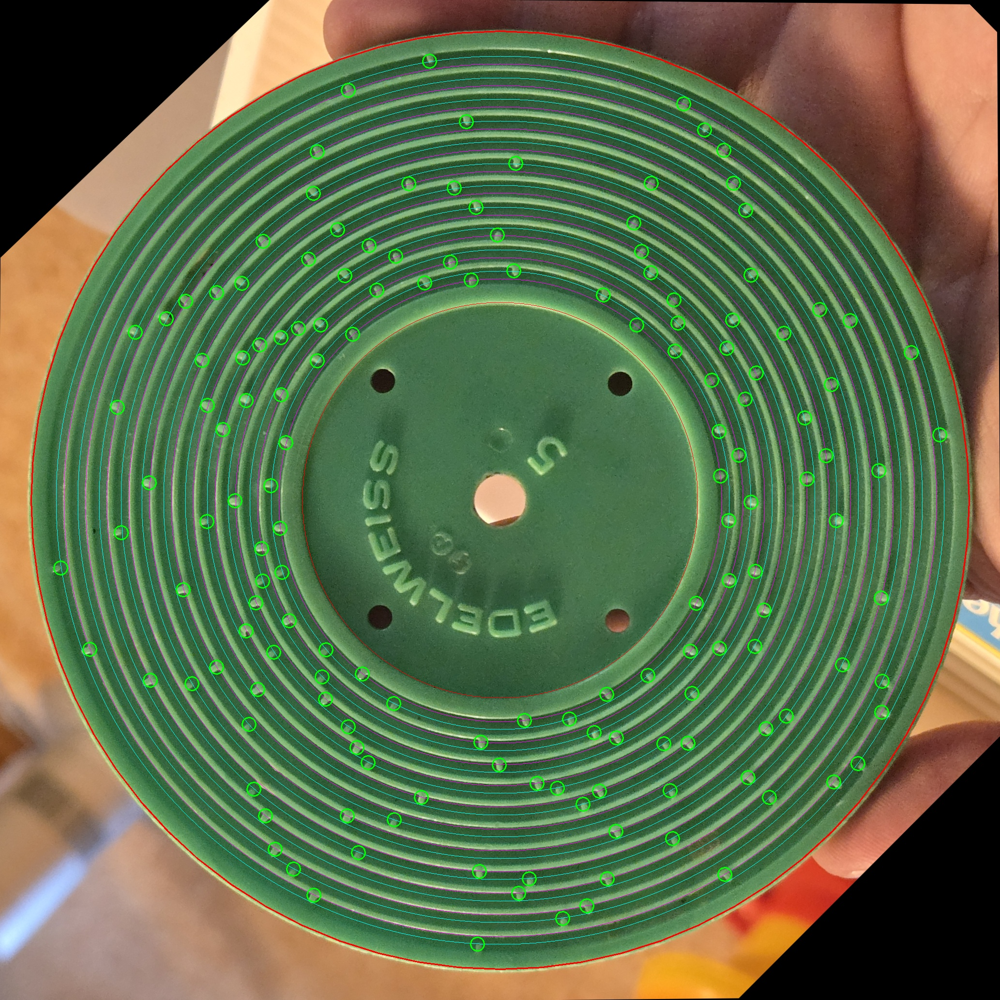
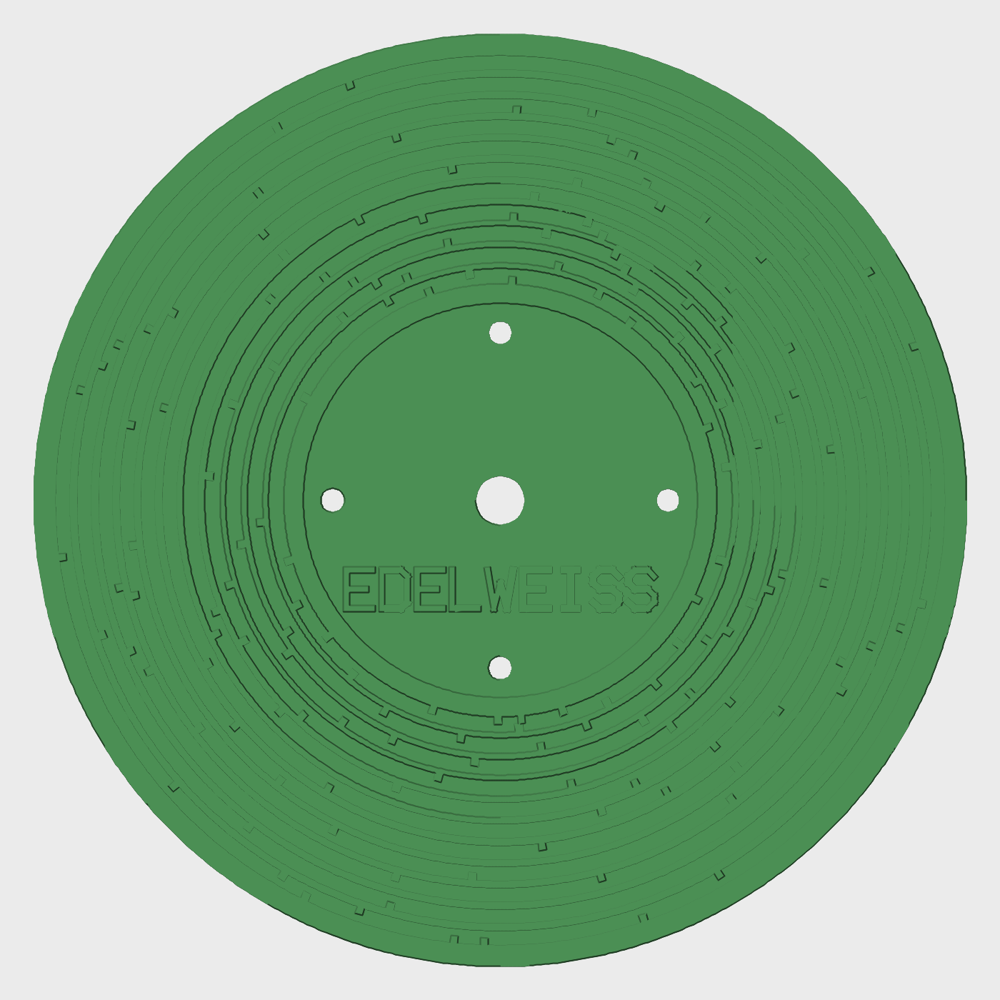

# Fisher-Price Record Studio

**Try it: https://shihanqu.github.io/fisher-price-record-studio/**

The 1971 Fisher-Price #995 Music Box Record Player plays little plastic records:
raised pins on eleven concentric grooves pluck a 22-tine comb as the disc turns.
This project does two things with them. Photograph a record and it reads the
tune back. Give it a short loop of music and it produces a record you can 3D
print and play on the toy.

The whole app runs in your browser. The site is plain static files on GitHub
Pages, photos are read on the page and never uploaded, and the STL is built on
your own machine.

## What it does

| Note Scanner | Record Designer |
| --- | --- |
|  |  |
| Choose a photo of a record. It gets straightened, every pin on the 22 tracks is found, and the tune plays back. Export as JSON, MIDI or WAV, or send it to the designer. | Draw a loop on the piano roll or import a MIDI file. It becomes pins on a real record, shown in 3D as you edit and downloadable as a print-ready STL. |

| The original *Edelweiss* record, as scanned | The same tune re-created as an STL |
| --- | --- |
|  |  |

## How it runs in a browser

The web app in `docs/` is a JavaScript port of the Python library in `fpmb/`.
The scanner does its image processing in a Web Worker so the page stays
responsive. A scan of the sample photo takes about a second and a half in
Chrome on the Mac this was built on. Big phone photos are scaled down to 3000
pixels on the long side first, which costs nothing: the reference photo gives
the same 157 pins even at 1600 pixels.

The record is built with the WebAssembly build of manifold, the same CSG
library the Python side uses, so the STL from the page has the same triangles,
volume and genus as the one from the command line. three.js draws the preview.
Both libraries are copied into `docs/vendor`, so nothing is fetched from a CDN
at run time. `tests/test_js_parity.py` checks that the port and the Python
code still agree (see Tests).

To run the site on your own machine, serve `docs/` with any static file
server. Opening `index.html` straight from disk won't work, because browsers
refuse ES modules and workers on `file://` pages.

```bash
python3 -m http.server 8000 -d docs
```

Then open http://localhost:8000.

## Layout

```
docs/                 the web app, served as-is by GitHub Pages
  index.html          home page
  scanner.html        Note Scanner
  designer.html       Record Designer
  js/                 browser code: extract.js is the scanner (with imgproc.js
                      and signal.js), mesh.js builds the record, plus score,
                      synth, midi, geometry and the page scripts
  vendor/             three.js 0.160.0 and manifold 3.5.3, with their licences
  samples/            the photo behind "Try the sample photo"
  img/                screenshots used here and on the home page
fpmb/                 the Python library the web app was ported from
  geometry.py         disc, groove and pin dimensions; the comb's 22 pitches; rotation
  score.py            note-event model (JSON), text and MIDI import, track assignment
  extract.py          photo -> pins -> score
  synth.py            score -> WAV / MIDI
  mesh.py             score -> watertight STL (manifold3d)
  strokefont.py       small stroke font for the embossed label
extract_record.py     CLI: photo -> .json / .wav / .mid  (with --play and --debug)
design_disc.py        CLI: .mid / .json / text loop -> .stl / .json / .wav
compare_extractions.py  cross-checks two photos of the same record
tests/                round-trip test, JS/Python parity test and its Node runner
tools/shots.py        re-takes the screenshots with headless Chrome
data/                 reference photos and audio (the 340 MB source video is not in the repo)
output/               example results
```

## Reading a record from a photo

In the browser, open the scanner and drop a photo onto it. Any angle works as
long as the whole grooved side is in view. Hands and the tone arm are masked
out and reported as missing coverage.

The command-line version does the same thing:

```bash
.venv/bin/python extract_record.py data/edelweiss_record.jpg --title Edelweiss --play --debug
```

This writes a score (`.json`), a rendering (`.wav`) and a MIDI file next to the
photo. With `--debug` you also get a folder of diagnostic images:
`02_rectified_pins.jpg` draws every detected pin on the straightened disc and
`04_track_signals.png` plots the detection signal for each track. `--quantise 100`
snaps the timings to 100 beats per revolution. `--seconds-per-rev` sets the
playback tempo.

How it works, in order. The green disc is segmented and its outline fitted with
an ellipse, and the photo is warped so the disc becomes a circle at 16 pixels
per millimetre. The centre hole and the four drive holes then refine that warp
into a full homography, which matters because under perspective the centre of
the ellipse is not the centre of the disc. The disc is unwrapped into polar
coordinates and the eleven groove walls are located sector by sector. For each
of the 22 pin tracks a signal is built along the angle that reads 1 at wall
height and 0 on the groove floor. A pin has to be at wall height from the wall
face to its tip, which rejects bleed from the pin on the far side of the same
groove. Where perspective shows a lit wall face that outshines any pin top, a
pin is also accepted when it stands well clear of the floor's own noise.

The photo in `data/` yields 157 pins. Running the same code on a frame of the
video, where the record sits on the player with the arm hiding a quarter of it,
agrees on 103 of the 104 pins it can see. The top line reads C6 Eb6 Bb6 Ab6 Eb6
Db6 C6 C6 C6 Db6 Eb6 F6 in the half-note, quarter-note waltz rhythm of
Edelweiss, which is a good sign that pitch mapping, track sides and time
direction are all right.

## Designing a record

In the browser, click notes onto the piano roll, type a loop in the text box,
or import a MIDI file, a score JSON or a photo of a record. The 3D preview
rebuilds as you edit, and Download STL saves exactly what the preview shows.

From the command line:

```bash
.venv/bin/python design_disc.py song.mid --repeats 2 --auto-transpose --label "MY SONG" --out output/my_song
```

```bash
.venv/bin/python design_disc.py --text "C5 Eb5 G5 C6 . G5 Eb5 C5" --repeats 6 --out output/arp
```

```bash
.venv/bin/python design_disc.py output/edelweiss.json --out output/edelweiss_reprint
```

The last one reprints the original record from its scan. In the text notation
each token is one step: `.` is a rest, `C5+Eb5` is a chord, `|` is a bar line
and is ignored, and a token starting with `#` comments out the rest of the line.

A few rules the designer follows. The comb has 16 pitches, Eb4 Ab4 Bb4 C5 Eb5
F5 G5 Ab5 Bb5 C6 Db6 Eb6 F6 G6 Ab6 Bb6, which is Ab major. Anything else is
snapped to the nearest playable pitch, or you can pass `--auto-transpose` to
find the shift that keeps the most notes. Six of those pitches (Ab5, Bb5, C6,
Db6, Eb6, F6) have two tines each, and notes alternate between them so quick
repeats work. Two pins on the same track need at least 2.2 mm of groove between
them or the second is dropped and reported. The player's spring motor can
only pluck about three tines at once, so the designer warns (and marks the
step in red on the piano roll) wherever more than three notes sound together.
One revolution holds the loop
times the repeat count. The WAV preview uses the seconds-per-revolution setting,
which I measured at 45 s on my player, though it slows as the spring unwinds.

## Geometry

All in millimetres. Disc radius 60.58, thickness 3.2. Centre hole radius 3.22,
four drive holes of radius 1.55 at 21.8 from the centre, and a label recess of
radius 25.6, 1.0 deep. Eleven grooves, 2.0 wide and 1.2 deep, at inner radii
28.15 through 55.9 with a pitch of 2.775. Each groove carries two tines: a
1 x 1 mm pin on the inner wall plays the lower note of the pair, one on the
outer wall the higher. The dimensions follow Fred Murphy's community OpenSCAD
template and were checked against the photographs. The pitch set was measured
from the video's audio and is within 10 cents of A440 equal temperament
throughout. Seen from above the record turns clockwise, so time runs with
increasing (anticlockwise) angle on the disc, and a 2 mm tangential offset for
the tone arm is applied per track.

## Tests

The Python tools need a virtual environment:

```bash
python3 -m venv .venv && .venv/bin/pip install numpy scipy pillow opencv-python-headless mido manifold3d trimesh websocket-client
```

```bash
.venv/bin/python tests/test_roundtrip.py
```

```bash
.venv/bin/python tests/test_js_parity.py
```

```bash
.venv/bin/python compare_extractions.py data/edelweiss_record.jpg data/edelweiss_on_player_t30.jpg
```

The round-trip test renders fake photos of random records at random tilts and
checks that every pin comes back with none invented.

The parity test runs the browser code under Node (version 18 or later) and
compares it with the Python library. The geometry constants must be identical,
and the stand-ins for the scipy filters and peak finder must match scipy on
random data. Text parsing, track assignment and quantising must give the same
scores, and the MIDI files must be byte-for-byte the same as mido's. The record
mesh must have the same triangle count, volume and genus as manifold3d's. The
scanner must find the same 157 pins as the Python extractor on the Edelweiss
photo, and every pin on the synthetic photos.

The last command lines up two photos of the same record and lists the pins
they disagree on.
