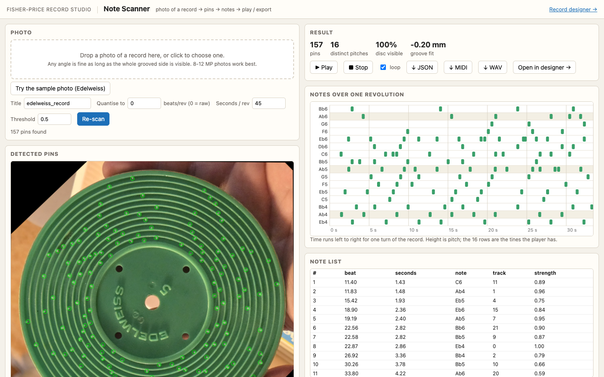
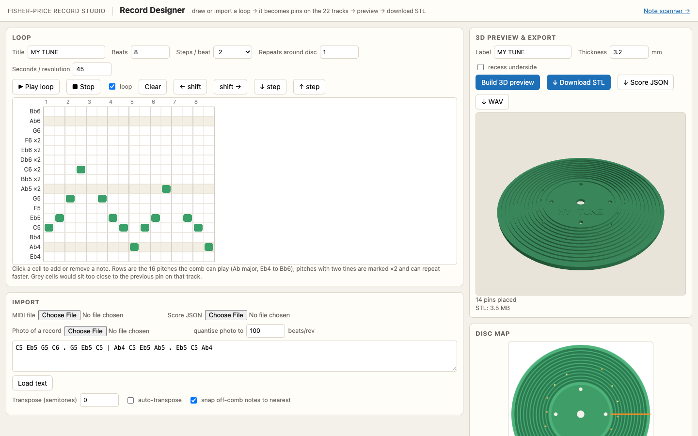

# Fisher-Price Record Studio

Tools for the 1971 Fisher-Price #995 *Music Box Record Player*: read the tune
off a photo of one of its plastic records, play it back, and design new
records (as STL files for 3D printing) from a short loop of music.

**Live demo:** https://shihanqu.github.io/fisher-price-record-studio/ (static: shows the
sample scan and lets you play with the designer; scanning your own photo and
exporting STL need the local server below).

## What it does

| Note Scanner | Record Designer |
| --- | --- |
|  |  |
| Drop in a photo of a record. It is straightened, every pin on the 22 tracks is found, and the tune is played back and exported as JSON / MIDI / WAV. | Draw a loop or import MIDI. It becomes pins on a real record, previewed in 3D, downloadable as a print-ready STL. |

| The original *Edelweiss* record, as scanned | The same tune re-created as an STL |
| --- | --- |
|  |  |

```
fpmb/                 shared library
  geometry.py         disc / groove / pin dimensions, the comb's 22 pitches, rotation
  score.py            note-event model (JSON), text + MIDI import, track assignment
  extract.py          photo -> pins -> score
  synth.py            score -> WAV / MIDI
  mesh.py             score -> watertight STL (manifold3d CSG)
  strokefont.py       tiny stroke font for the embossed label
extract_record.py     CLI: photo -> .json / .wav / .mid  (+ --play, --debug)
design_disc.py        CLI: .mid / .json / text loop -> .stl / .json / .wav
compare_extractions.py  cross-check two photos of the same record
webapp/               Record Studio web apps (one server): note scanner, record designer
  build_static.py     builds the hosted demo into docs/ (GitHub Pages)
  shots.py            refreshes the home-page screenshots with headless Chrome
docs/                 the static demo published at the live-demo link above
tests/test_roundtrip.py synthetic photo round-trip test for the extractor
data/                 the reference photos and derived audio (the 340 MB source video is not in the repo)
output/               results
```

## Setup

```bash
python3 -m venv .venv && .venv/bin/pip install numpy scipy pillow opencv-python-headless mido manifold3d trimesh
```

## 1. Read a record from a photo

```bash
.venv/bin/python extract_record.py data/edelweiss_record.jpg --title Edelweiss --play --debug
```

Writes `data/edelweiss.json` (the score), `.wav` and `.mid`, and with `--debug`
a folder of diagnostic images (`02_rectified_pins.jpg` shows every detected
pin drawn on the straightened disc; `04_track_signals.png` shows the per-track
detection signal).  `--quantise 100` snaps the timings to 100 beats per
revolution; `--seconds-per-rev` sets the playback tempo.

How it works: the green disc is segmented and its outline fitted with an
ellipse; the image is warped so the disc is a circle at 16 px/mm; the centre
and drive holes refine that warp to a full homography (the ellipse centre is
not the disc centre under perspective); the disc is unwrapped to polar
coordinates; the eleven groove walls are located per angular sector; and for
each of the 22 pin tracks a signal is built that is 1 at wall height and 0 on
the groove floor.  A pin must be at wall height both at the wall face and at
its tip, which rejects bleed from the pin on the other side of the same
groove.  Because perspective can make a lit wall *face* far brighter than
any pin top in part of the disc, a pin is also accepted when it stands
clearly above the groove floor's own noise (signal-to-noise path).  The
wall reference is floored at half its typical value so a shadowed wall (the
label rim, the outer rim under a finger) cannot inflate scores.  Anything
not visible (a hand, the tone arm) is masked out and reported as missing
coverage.

Web version:

```bash
.venv/bin/python webapp/server.py scanner      # http://localhost:8765/scanner
```

Drop a photo on the page: it shows the straightened disc with every pin
circled, the notes on a time/pitch grid, plays the tune (with the arm
position swept over the photo), and exports JSON / MIDI / WAV.  "Open in
designer" hands the score to the designer for re-printing.

The photo in `data/` gives 157 pins.  The same extractor run on a frame of
the video (record on the player, arm hiding a quarter of it) agrees on 103 of
the 104 pins it can see.  The melody line reads C6 Eb6 Bb6 Ab6 Eb6 Db6 C6 C6 C6
Db6 Eb6 F6 with the half/quarter waltz rhythm of Edelweiss.

## 2. Design a record

Command line:

```bash
.venv/bin/python design_disc.py song.mid --repeats 2 --auto-transpose --label "MY SONG" --out output/my_song
.venv/bin/python design_disc.py --text "C5 Eb5 G5 C6 . G5 Eb5 C5" --repeats 6 --out output/arp
.venv/bin/python design_disc.py output/edelweiss.json --out output/edelweiss_reprint   # re-print the original
```

Web app (piano roll, MIDI/photo import, WebAudio playback, 3D preview,
STL download):

```bash
.venv/bin/python webapp/server.py designer     # http://localhost:8765/designer
```

(`webapp/server.py` with no argument opens the Record Studio home page, which
links to both apps.  `webapp/shots.py` refreshes the home page's screenshots
with headless Chrome; run it after changing either app's layout.)

The page calls the same Python geometry code, so the preview is the exact
mesh you download.

Rules the designer applies:

* Only the 16 pitches of the comb are printable: Eb4 Ab4 Bb4 C5 Eb5 F5 G5 Ab5
  Bb5 C6 Db6 Eb6 F6 G6 Ab6 Bb6 (Ab major).  Other notes are snapped to the
  nearest playable pitch, or use `--auto-transpose`.
* Ab5, Bb5, C6, Db6, Eb6 and F6 have two tines each; notes alternate between
  them so quick repeats work.  Two pins on the same track must be at least
  2.2 mm apart along the groove or the second is dropped (reported).
* One revolution is the loop length x repeats; the WAV preview uses the
  seconds-per-revolution setting (45 s measured on this player, but it slows
  as the spring unwinds).

## Geometry (mm)

Disc radius 60.58, thickness 3.2, centre hole r 3.22, four drive holes
r 1.55 at 21.8 from centre, label recess r 25.6 x 1.0 deep.  Eleven grooves
2.0 wide x 1.2 deep at inner radii 28.15 ... 55.9 (pitch 2.775).  Each groove
carries two tines; a 1 x 1 mm pin on the inner wall plays the lower note of
the pair, one on the outer wall the higher.  Dimensions follow Fred Murphy's
community OpenSCAD template and were checked against the photographs.  The
pitch set was measured from the video's audio (all within 10 cents of
A440 equal temperament).  The record turns clockwise seen from above, so
time runs with increasing (anticlockwise) angle on the disc; a 2 mm tangential
tone-arm offset correction is applied per track.

## Tests

```bash
.venv/bin/python tests/test_roundtrip.py      # renders fake photos of random records and re-reads them
.venv/bin/python compare_extractions.py data/edelweiss_record.jpg data/edelweiss_on_player_t30.jpg
```
